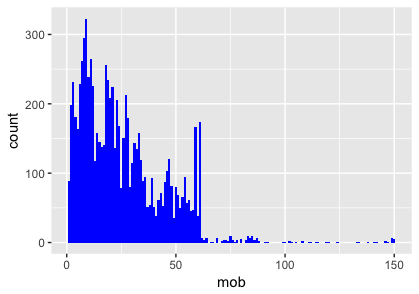
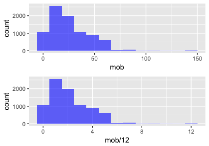
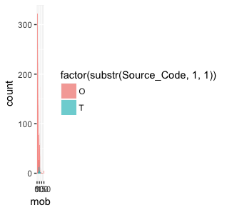

  From last post we create _Sales Single View_, in this post we analysis the swiching profiles.
  
## Motivation : Profiling switching behavior

  In performance management, one key good indicator is the continuously working of the sales person. That show how best we could attract the representatives loyalties. Since the non-obligation representative model, sales person could work or not work for us anytime. Then profiling switching behavior could help in campaign effectiveness, especially on period of motivation.

  First we start off with **mob** (Month On Book) of sales
```
load("da.RData")
library(ggplot2)
library(dplyr)
library(gridExtra)
library(tidyr)

ggplot(data = os_agent_s_view) +
  geom_histogram(mapping = aes(x = mob), fill = 'blue', binwidth = 1)
```
  We count no. of new sales registered look back on mob; mob = 1 = first month, mob = 2 = secound month, onward. However, the histogram so fuzzy and couldn't extract any information from graph. 



  Then with a little modification on ploting data from montly to yearly, which could do 2 ways
  
  1. Divided mob by 12 (12 months = 1 yr.)
  2. Adjust `binwidth = 1` to `binwidth = 12`
  
```
g1 <- ggplot(data = os_agent_s_view, aes(x = mob)) +
  geom_histogram(mapping = aes(x = mob), fill = 'blue', alpha = 0.6, binwidth = 12)
g2 <- ggplot(data = os_agent_s_view) +
  geom_histogram(mapping = aes(x = mob/12), fill = 'blue', alpha = 0.6, binwidth = 1)

grid.arrange(g1, g2)
```


  From above picture, no of sales registered have increased trend, form highest last year and increasing from prior year. Since, there is subgroup within this shunk of sales which we could split into 2 group; group **O** and group **T** as plot below.

```
ggplot(data = os_agent_s_view) +
  geom_histogram(mapping = aes(x = mob, fill = factor(substr(Source_Code, 1, 1))),
                 alpha = 0.6, binwidth = 1, position = 'identity')
```

