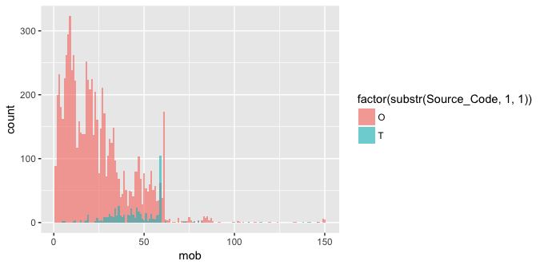

  From last post we create _Sales Single View_, in this post we analysis the swiching profiles.
  
## Motivation : Profiling switching behavior

  In performance management, one key good indicator is the continuously working of the sales person. That show how best we could attract the representatives loyalties. Since the non-obligation representative model, sales person could work or not work for us anytime. Then profiling switching behavior could help in campaign effectiveness, especially on period of motivation.

### Month on book

  First we start off with **mob** (Month On Book) of sales
```
load("da.RData")
library(ggplot2)
library(dplyr)
library(gridExtra)
library(tidyr)

ggplot(data = os_agent_s_view) +
  geom_histogram(mapping = aes(x = mob), fill = 'blue', binwidth = 1)
```
  We count no. of new sales registered look back on mob; mob = 1 = first month, mob = 2 = secound month, onward. However, the histogram so fuzzy and couldn't extract any information from graph. 


  Then with a little modification on ploting data from montly to yearly, which could do 2 ways
  
  1. Divided mob by 12 (12 months = 1 yr.)
  2. Adjust `binwidth = 1` to `binwidth = 12`
  
```
g1 <- ggplot(data = os_agent_s_view, aes(x = mob)) +
  geom_histogram(mapping = aes(x = mob), fill = 'blue', alpha = 0.6, binwidth = 12)
g2 <- ggplot(data = os_agent_s_view) +
  geom_histogram(mapping = aes(x = mob/12), fill = 'blue', alpha = 0.6, binwidth = 1)

grid.arrange(g1, g2)
```


  From above picture, no of sales registered have increased trend, form highest last year and increasing from prior year. Since, there is subgroup within this shunk of sales which we could split into 2 group; group **O** and group **T** as plot below.

```
ggplot(data = os_agent_s_view) +
  geom_histogram(mapping = aes(x = mob, fill = factor(substr(Source_Code, 1, 1))),
                 alpha = 0.6, binwidth = 1, position = 'identity')
```


    Since in this assignment we focus on group = 'O' then we create anathor plot with adjust on binsize to 3 (= Quarterly) and also added more details on X-Axis

```
# histogram plot with adjusted axis x ticks
os_agent_s_view %>%
  filter(Source_Code == 'O') %>%
  ggplot() +
  geom_histogram(mapping = aes(x = mob), binwidth = 3, color = 'white') +
  scale_x_continuous(name = 'Month On Book', breaks = seq(0, 150, 3))
```


From graph shown spike for every multiples of 9; 9, 18 and 27 mob. Which may infer that the new registered sales have cyclical pattern of registration for every 9 months.

### Consistency : number of Straight month
Next we analysis the consistency of performance. Measurement of consistency we use number fo straight month, count of consecutive month with sales performance occurred. How to calculate **Straight** monht as picture follow.


Since one sales after registered could have difference straight month profile. Then we focus on _max straight month_ and _average straight month_ data.

```
m <- os_agent_s_view %>%
  filter(Source_Code == 'O') %>%
  ggplot() +
  geom_histogram(mapping = aes(x = max_straight_mo), binwidth = 1, fill = 'blue', alpha = 0.6) +
  scale_x_continuous(breaks = seq(1, 40, 1))

a <- os_agent_s_view %>%
  filter(Source_Code == 'O') %>%
  ggplot() +
  geom_histogram(mapping = aes(x = avg_straight_mo), binwidth = 1, fill = 'green', alpha = 0.6) +
  scale_x_continuous(breaks = seq(1, 40, 1))
```

We could plot each graph with help from package **gridExtra** ; ` grid.arrange(m, a)` which resulted as plot below.


How both histograms are totally rigth-skew. Because we plot without take mob in consideration, then just start sales with small mob will definitely have small straight month.

Then we scope on sales with _mob > 24_ - registered more than 2 years - and time of switching occurred more than 4 times in the past. With help from **tidyr** transform data that could plot both max straight month and avg straight month on same graph.

```
os_agent_s_view %>%
  filter(mob >= 24 & Source_Code == 'OSS' & count_straight_time >= 4) %>%
  select(Agent_Code, min_straight_mo, avg_straight_mo, max_straight_mo) %>%
  gather(str_type, mo, max_straight_mo, min_straight_mo, avg_straight_mo) %>%
  ggplot() +
  geom_freqpoly(mapping = aes(x = mo, color = str_type), binwidth = 1) +
  scale_x_continuous(breaks = seq(1, 150, 1)) +
  coord_cartesian(xlim = c(0, 20))
```


Focus to _avg straight month_ spike on 2 month and 4 month, show sales swiching occurred mostly 2 and 4 month.
